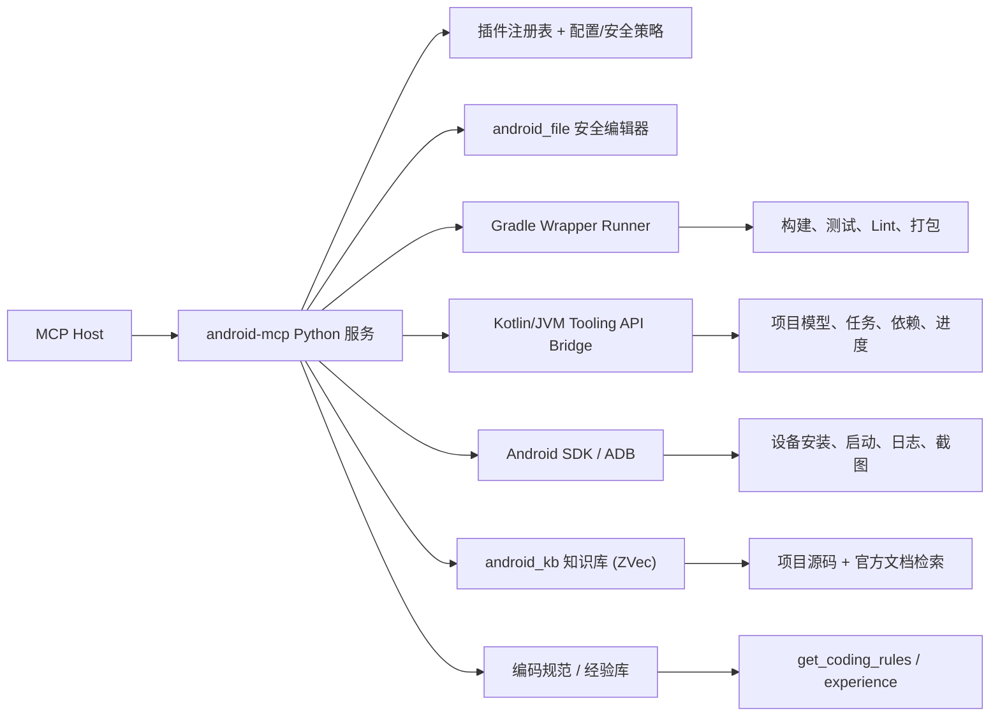

# Kotlin Android MCP 设计方案

> 版本 v2.0 — 基于本地 daofy（Daofy for Delphi MCP Server）架构模式完善
>
> 本方案以 v1 为基础，将本地 daofy 已经沉淀并验证过的成熟模式（插件注册表、统一 action 分发、安全文件编辑、编辑保护、异步任务推送、知识库、编码规范、经验库、智能提示等）逐项映射到 Android 工程，形成一份可落地、可扩展的 Android MCP 服务设计。所有「继承自 daofy」的模式均标注了 daofy 对应源码位置，便于实现时对照。

## 0. 本版关键增强（相对 v1）

| # | 增强点 | 说明 | daofy 参照 |
| --- | --- | --- | --- |
| 1 | **插件化架构** | plugin + registry，工具按「核心 / android 插件」归属，按扩展名路由，动态发现 | `src/plugins/registry.py` |
| 2 | **`android_kb` 知识库** | 项目 Kotlin/XML 源码 + Android SDK/AGP/Kotlin 文档向量检索，支持类/函数/路径搜索 | `src/tools/delphi_kb` |
| 3 | **`get_coding_rules`** | Android/Kotlin 编码规范分段获取，降低 token、提升遵守率 | `src/tools/coding_rules.py` |
| 4 | **安全编辑增强** | 脏标记、old_content 归一化比对、文件级 RWLock、原子写入、dry_run 预览、`__history` 备份 | `src/tools/file_tool.py` |
| 5 | **编辑保护 + 文件监听** | 识别绕过工具的外部修改（如 Android Studio 手改），warn/strict 模式可配置 | `src/services/delphi_edit_guard.py` |
| 6 | **异步任务 MCP 推送** | TaskStatusNotification 主动推送 + 去重键 + 步骤进度 + 长轮询 + 取消 | `src/services/knowledge_base/async_task_manager.py` |
| 7 | **智能提示 / 工具尾注 / 日志脱敏** | 复用 daofy server 层模式，改善 AI 使用体验 | `src/server.py` |
| 8 | **经验库 `experience`** | 问题-方案经验沉淀与语义检索，形成团队积累 | `src/services/experience_service.py` |
| 9 | **MCP 资源** | `android://health`、`android://coding-rules`、`android://troubleshooting` 等 | `src/mcp_resources.py` |
| 10 | **环境自动检测缓存** | 首启动自动检测 SDK/JDK/AS/ADB/Gradle 并缓存到 config.json | `src/services/config_manager.py` |

## 1. 总体方案

构建一个名为 `android-mcp` 的本地 Windows MCP 服务：

- **MCP 主服务**：Python，独立虚拟环境（复用 daofy 的 stdio / UTF-8 重配置 / 依赖自愈模式）。
- **Gradle 深度桥接**：Kotlin/JVM fat JAR，使用 Gradle Tooling API。
- **编译执行**：优先使用项目自带 `gradlew.bat`；Tooling API 用于项目模型、任务发现、构建事件和取消。
- **Android Studio**：负责 JBR、SDK 定位和 IDE 打开能力，不作为核心编译依赖；真正的构建后端是 Gradle Wrapper + AGP。
- **知识库**：ZVec 向量引擎索引项目源码与 Android 官方资料，支撑语义检索。
- **MCP 传输**：本地 stdio，兼容 Codex、Claude、Trae 等 MCP 客户端。



## 2. 从 daofy 继承的设计模式

### 2.1 工具映射表

| daofy（Delphi） | android-mcp（Android） | 继承的关键能力 |
| --- | --- | --- |
| `delphi_project` | `android_project` | 项目模型 / 变体 / 任务 / 依赖 / 诊断（Tooling API） |
| `delphi_file` | `android_file` | 安全编辑：read/write/replace/insert/delete/format/backup/encode/grep |
| `delphi_file(uses)` | `android_file(imports)` | Kotlin import 增删 + 命名冲突检测 + 自动排序 |
| `delphi_file(DFM 转换)` | `android_file(manifest)` | AndroidManifest.xml / res 结构化编辑 |
| `manage_component` | `android_file(dependencies)` | build.gradle.kts 依赖增删与版本对齐 |
| `delphi_kb` | `android_kb` | 知识库 search/stats/build/read |
| `get_coding_rules` | `get_coding_rules` | 编码规范分段获取 |
| `check_environment` | `android_environment` | SDK/JDK/AS/ADB/Gradle 检测 |
| `delphi_rtti` | `android_device(uia)` | UIAutomator 层级查看（阶段 6） |
| `automate_delphi` | `android_automate` | UIAutomator UI 自动化（阶段 6） |
| `async_task` | `android_task` | 去重 / 进度 / 取消 / MCP 推送 / 长轮询 |
| `tool_help` | `tool_help` | 按需帮助 |
| `experience` | `experience` | 经验库 |
| `daofy_update` | `android_mcp_update` | 版本检查与更新 |
| `code_hosting` | `code_hosting` | Git / 托管平台 API（复用） |
| `ocr` | `android_device(screenshot + ocr)` | 截图 OCR 辅助 UI 测试 |

### 2.2 关键模式落地清单

| daofy 模式 | 源码位置 | Android 落地方式 |
| --- | --- | --- |
| 插件动态发现 + 工具归属 | `plugins/registry.py` | `AndroidPlugin` 声明 `android_*` 工具；`is_available()` 依据 SDK/AGP 存在性门控注册 |
| 统一 action 分发 | `plugins/delphi/handlers.py` | 每个 `android_*` 工具内部按 `action` 分发到 handler |
| 工作区根缓存 | `server.py:_fetch_workspace_roots` | MCP roots → `project_root` 推断回退 |
| 多读单写文件锁 | `tools/file_tool.py:_get_rw_entry` | 同文件并发读/写互斥，冲突时返回可操作错误 |
| 脏标记 | `tools/file_tool.py:_mark_dirty` | 写入/格式化后强制 re-read 或用 old_content 校验 |
| old_content 归一化比对 | `tools/file_tool.py:_normalize_code_for_compare` | Kotlin 版本：跳过字符串/注释，空白不敏感比对 |
| 原子写入 | `tools/file_tool.py:_write_text_temp/_replace_with_temp` | 同卷临时文件 + `os.replace`，失败自动回滚备份 |
| 自动备份 `__history` | `utils/file_backup.py` | 每次修改前备份，`backup(action=restore)` 可回滚 |
| 编辑保护 | `services/delphi_edit_guard.py` | 受保护扩展名 `.kt/.java/.kts/.xml/.gradle`；外部修改 warn/strict |
| 文件监听 | `services/knowledge_base/file_watcher.py` | watchdog 监听项目目录 → 增量 KB + 外部编辑检测 |
| 异步任务 | `services/knowledge_base/async_task_manager.py` | 去重键、步骤进度、取消、完成回调推送通知 |
| 智能提示 | `server.py:_get_smart_hint` | 构建/检索后追加「下一步工作流」建议 |
| 工具尾注 | `server.py:_get_delphi_file_footnote` | 提醒 AI 使用 `android_file`，避免内置 Read/Edit |
| 日志脱敏 | `server.py:_redact_sensitive_arguments` | env/storePassword/签名等敏感参数打码 |
| 配置自愈 | `services/config_manager.py` | 多候选路径自动选择 + 首启动自动检测 |
| 编码降级链 | `tools/file_tool.py:_read_content` | 检测 → 指定 → utf-8 → ANSI → CJK 回退链 |
| 结果统一信封 | `server.py:call_tool` | `{"success": bool, "data": ...}` + 可选 timing |

## 3. 架构与目录结构

参考 daofy 的分层（server → plugins → services → tools → utils → resources），android-mcp 采用：

```
android-mcp/
├── pyproject.toml
├── src/
│   ├── server.py                  # MCP 服务器、工具注册、智能提示/尾注/脱敏、健康资源
│   ├── mcp_resources.py           # android:// 资源索引与读取
│   ├── tool_docs.py               # tool_help 文档中心（按工具/action 检索）
│   ├── plugins/
│   │   ├── base.py                # CompilerPlugin 基类 + ToolDefinition + PluginInfo
│   │   ├── registry.py            # 插件注册表（发现/注册/扩展名路由/handler 分发）
│   │   ├── core/                  # 核心工具：android_task/tool_help/experience/code_hosting/android_mcp_update
│   │   │   └── handlers.py
│   │   └── android/               # Android 插件
│   │       ├── plugin.py          # 工具归属 + 扩展名映射（.kt/.kts/.xml/.gradle/.java）
│   │       └── handlers.py        # action 分发到 services
│   ├── services/
│   │   ├── config_manager.py      # 环境配置自动检测与缓存
│   │   ├── environment.py         # SDK/JDK/Android Studio/ADB/Gradle 发现与注入
│   │   ├── wrapper_runner.py      # gradlew 执行器（超时/取消/日志/并发单任务）
│   │   ├── tooling_bridge.py      # Kotlin/JVM bridge 的 JSONL 客户端
│   │   ├── edit_guard.py          # 编辑保护（受保护扩展名 + 外部修改检测）
│   │   ├── file_watcher.py        # watchdog 文件监听（增量 KB + 外部编辑）
│   │   ├── build_diagnostics.py   # Kotlin/Gradle/AAPT2/Manifest/D8 错误解析
│   │   ├── async_task_manager.py  # 异步任务（去重/进度/取消/推送）
│   │   ├── knowledge_base/        # ZVec 项目 KB + Android 官方资料 KB
│   │   └── experience_service.py  # 经验库
│   ├── tools/                     # 各工具 handler（按 action 分发）
│   │   ├── file_tool.py           # android_file
│   │   ├── project.py             # android_project
│   │   ├── build.py               # android_build
│   │   ├── device.py              # android_device
│   │   ├── knowledge_base.py      # android_kb
│   │   ├── coding_rules.py        # get_coding_rules
│   │   ├── environment.py         # android_environment
│   │   └── ...
│   └── utils/
│       ├── file_backup.py         # __history 备份/恢复/列表
│       ├── kotlin_normalize.py    # Kotlin old_content 归一化比对
│       ├── xml_edit.py            # XML 结构化编辑（manifest/res）
│       ├── android_env.py         # SDK 路径/版本/JDK 发现
│       └── logger.py
├── bridge/                        # Kotlin/JVM Tooling API Bridge（fat JAR）
│   ├── build.gradle.kts
│   └── src/main/kotlin/...
└── scripts/
    ├── install.ps1                # venv + pip 依赖 + gradle JAR 构建
    └── mcp-config.example.json
```

## 4. MCP 工具接口

公共参数统一采用（`project_root` 未提供时，只允许从 MCP roots 工作区根或已配置项目根推断，不扫描整个 `D:/Android`）：

```json
{
  "project_root": "D:/Android/adb-controller",
  "module": "app",
  "variant": "debug",
  "timeout_seconds": 1800
}
```

服务器级 instructions（握手时注入，提示 AI 正确使用工具）：

```
android-mcp: Kotlin/Gradle/XML 文件必用 android_file，编码/构建前先 get_coding_rules；
复杂工具调用前先用 tool_help(tool_name, action) 获取当前 action 的参数。
```

### 4.1 `android_environment`

支持 `detect`、`doctor`、`check`。返回 JDK、SDK、ADB、Android Studio、Gradle Wrapper、AGP、Kotlin、Build Tools 的路径、版本、兼容性和缺失项。检测结果缓存到全局 `config.json`（见 §12），检测逻辑复用 daofy 的「注册表 → 环境变量 → 默认路径 → PATH」多级发现与降级链：

1. JDK：项目 `org.gradle.java.home` → `JAVA_HOME` → Android Studio `jbr` → PATH。
2. SDK：项目 `local.properties` 的 `sdk.dir` → `ANDROID_SDK_ROOT`/`ANDROID_HOME` → Windows 默认 SDK 路径。
3. ADB：SDK `platform-tools/adb.exe` → PATH。
4. Gradle：项目 `gradlew.bat`/`gradlew`，不依赖全局 Gradle。
5. Android Studio：默认安装目录 + 注册表 + 用户配置目录（daofy 的 `winreg` 发现模式）。

关键点（同 daofy）：**即使没有 `JAVA_HOME`/`ANDROID_HOME` 环境变量，也要主动定位 Android Studio JBR、SDK 与 ADB，并在启动 Gradle 前注入环境变量**。环境检测是后续所有构建的前置动作，`doctor` 输出可读的诊断与修复建议。

### 4.2 `android_project`

支持 `discover`、`info`、`modules`、`variants`、`tasks`、`dependencies`、`sync`、`diagnose`。

- 走 Tooling API（`GradleConnector.forProjectDirectory(...)`）查询项目层级、模块、变体、任务与依赖。
- Android 特有的变体/APK 输出使用公开 Gradle 能力 + 输出目录解析，不依赖 AGP 内部类。
- `sync` 输出结构化 diff（模块/依赖/任务变化），类比 daofy 的 `delphi_project(audit)`。
- `diagnose` 汇总环境、Wrapper、Gradle 版本、AGP 兼容性、JVM target 匹配等问题。

### 4.3 `android_file`

支持 `read`、`grep`、`write`、`replace`、`insert`、`delete`、`format`、`backup`、`encode`，以及 Kotlin/Android 专属动作 `imports`、`manifest`、`dependencies`。

修改参数统一采用（对齐 daofy 的 edits 模型，`dry_run=true` 预览 diff，`dry_run=false` 落盘）：

```json
{
  "action": "replace",
  "project_root": "D:/Android/adb-controller",
  "file_path": "app/src/main/java/com/adbcontroller/ui/MainActivity.kt",
  "edits": [
    {
      "start_line": 20,
      "end_line": 24,
      "old_content": "旧内容原文（逐字校验，空白不敏感）",
      "content": "新内容"
    }
  ],
  "dry_run": true,
  "backup": true
}
```

核心规则（详见 §5）：

- 修改操作先返回 diff，`dry_run=false` 才落盘。
- 现有文件每个 edit 必须带 `old_content` 或文件版本哈希；比对时对 Kotlin 做归一化（跳过字符串/注释、空白不敏感）。
- 自动备份到 `__history`，支持回滚。
- 禁止路径逃逸；禁止直接修改 `local.properties`、密钥库、密码配置、`.gradle`、`build`、`.idea`。
- 格式化优先调用项目已有的 `ktlint`/`spotless` 任务。
- 写入后文件标记为「脏」，AI 须重新 `read` 或用 `old_content` 校验后方可再次写入，防止过期行号错位改写。

**Kotlin import 管理（`action=imports`）**，类比 daofy 的 `uses` 子句操作：
- `add/remove` 单个 import，自动检测命名冲突（重名类）、自动去重与排序。
- 需兼容 `import a.b.C as D`（别名）与通配符 import，避免误删。

**Manifest / res 结构化编辑（`action=manifest`）**，类比 daofy 的 DFM 结构化编辑：
- 提供 `permissions`（增删权限）、`activities`（增删/注册 Activity）、`attributes`（application/activity 属性）子操作。
- 内部为 XML 感知编辑：保留原注释、缩进与命名空间声明；每次修改仍带 `old_content` 校验与备份。

**Gradle 依赖管理（`action=dependencies`）**，类比 daofy 的 `manage_component`：
- `add/remove` build.gradle.kts 中的 `implementation`/`api` 等依赖。
- 提供版本对齐提示（同库多模块版本不一致时告警）与 `dependencyResolutionManagement` 检查。

### 4.4 `android_build`

支持 `assemble`、`bundle`、`test`、`lint`、`check`、`clean`、`install`。

```json
{
  "action": "assemble",
  "project_root": "D:/Android/adb-controller",
  "module": "app",
  "variant": "debug",
  "backend": "auto",
  "tasks": [],
  "timeout_seconds": 1800,
  "confirm_release": false
}
```

- `backend=auto` 时优先 Tooling API，桥接器异常自动回退 Wrapper（daofy 的「优先级 + 降级」模式）。
- 任务名必须来自项目发现结果或受控变体任务模板，不接受任意 shell 命令。
- 长任务立即返回 `task_id`，由 `android_task` 轮询或 MCP 推送获得结果。
- 结构化结果统一信封（见 §8），含 `artifacts`、`diagnostics`、`logs`。

### 4.5 `android_device`

首版支持 `list`、`install`、`launch`、`stop`、`uninstall`、`logcat`、`screenshot`、`clear_log`。

- 多设备时强制要求 `serial`。
- APK 路径必须位于项目目录或已生成的构建产物目录。
- 首版不开放任意 `adb shell`，设备操作使用固定 action。
- `screenshot` 可与 `ocr` 配合做 UI 状态断言（阶段 6 自动化）。
- 无设备 / 多设备 / 设备离线时返回明确可操作的错误信息。

### 4.6 `android_kb`

支持 `search`、`stats`、`build`、`read`（类比 daofy `delphi_kb`）。

- **项目 KB**：索引当前项目 Kotlin/XML 源码，支持 `search_type=path/class/function/record` 定位与语义检索。
- **官方资料 KB**：Android SDK 源码（sources 目录）、AGP/Kotlin 关键文档。启动时自动构建/增量更新，文件监听触发增量索引。
- `read` 返回源码片段时附加提示：阅读完整源码用 `android_file(action=read)`。
- `stats` 返回索引规模与新鲜度，数据过期时提示 `build` 重建。

### 4.7 `get_coding_rules`

按 `section` 分段获取 Android/Kotlin 编码规范，降低 token 并提升遵守率（对齐 daofy）。建议章节：

```
workflow   工作流总览           env        环境检查（构建前）
kb_search  编码前查 API/依赖     writing    写 Kotlin 代码
xml        资源/布局/Manifest    gradle     构建脚本与依赖
format     格式化 (ktlint)      build      构建与诊断
review     代码审核             cleanup    清理与验证
safety     安全敏感操作          debugging  异常诊断
experience 经验保存              maintenance 规则维护
automation UIAutomator 测试架构  agent_rules Agent 操作硬规则
```

编码/构建/审核前分别获取对应章节（同 daofy 的用法提示）。

### 4.8 `android_task`

支持 `list`、`status`、`result`、`cancel`。构建、测试、安装、KB 构建等长任务立即返回 `task_id`。增强自 daofy：

- **去重键**：同一 `project_root + 任务名` 已在运行/排队时复用已有 `task_id`，避免并发重复构建。
- **步骤进度**：`current_step/total_steps/progress/message`，如「configure → compile → lint → package → sign」。
- **MCP 推送**：任务完成/失败/取消时向客户端主动推送 `TaskStatusNotification`，无需轮询（对齐 daofy server.py 注入 `_on_complete`）。
- **长轮询**：`status` 支持 `long_poll_seconds`，等待进度变化或终态。
- **取消**：通过 `_cancellation_check` 在构建边界响应，无法强制 kill 时返回明确说明。

### 4.9 `experience` / `tool_help` / `code_hosting` / `android_mcp_update`

- `experience`：save/search/get/list/prune，按标签与语义检索沉淀「问题 → 解决」经验，团队复用。
- `tool_help`：`tool_help(tool_name, action)` 返回该 action 的必需/可选参数与示例（同 daofy，避免把长文档塞进 tool description）。
- `code_hosting`：复用 daofy 的 Git 操作与托管平台 API。
- `android_mcp_update`：启动时后台检查版本，有新版本时在返回结果中提示（同 daofy 的更新检查与重试模式）。

## 5. 安全文件编辑（android_file 核心设计）

对齐 daofy `file_tool.py`，逐项落地：

### 5.1 路径校验（`_validate_path`）
- null 字节注入检查；`os.path.abspath(os.path.realpath(...))` 规范化。
- 系统敏感目录保护（Windows 系统目录等）。
- 项目目录限制：文件必须位于 `project_root`（或 roots 工作区根）之内。
- 禁止目录清单：`local.properties`、密钥库、密码配置、`.gradle`、`build`、`.idea`、`.git`。

### 5.2 文件级读写锁（RWLock）
- 同文件多读单写互斥；写锁存在时拒绝读，任何读写占用时拒绝再次写。
- 冲突时返回可操作错误：提示「将全部修改合并为一次 write(edits=[...])」。

### 5.3 脏标记（dirty flag）
- 每次写入/格式化/编码转换后标记脏；在重新 `read`、`dry_run` 预览或为每个 edit 提供 `old_content` 前，禁止再次写入。
- 防 AI 用过期行号导致错位改写；`allow_dirty=true` 可显式绕过（风险自负）。

### 5.4 old_content 归一化比对
- 现有文件的每个 edit 强制要求 `old_content`。
- Kotlin 归一化（`kotlin_normalize.py`）：跳过单行/块注释、普通与三引号字符串、字符串模板；代码区删除空白、仅在防 token 粘连处补单空格。
- 比对失败返回 `expected/actual` 行内片段（带行号），便于 AI 自纠。
- `old_content` 过短（如单独 `}`）时给出非阻断警告，建议包含更多上下文行。

### 5.5 原子写入 + 自动备份
- 先写同卷临时文件并 `flush + fsync`，成功后 `os.replace` 原子替换。
- 写入前自动备份到同目录 `__history`（daofy 模式），`backup(action=restore)` 可回滚到指定版本。
- 任何一步失败即取消写入并回滚备份，不留下半成品。

### 5.6 dry_run 预览
- `dry_run=true` 时输出逐 edit 的 diff（含行号、`-`/`+` 行、偏移量）与「未变区域」提示，不落盘、不改脏标记。
- 对齐 daofy：已删除独立的 `preview` 参数，统一用 `dry_run`。

### 5.7 编码处理
- 自动检测编码（UTF-8/UTF-8-sig/UTF-16/GBK 等），写入保持原编码。
- 编码降级链：检测 → 用户指定 → utf-8 → 系统 ANSI → CJK 回退。
- 写入编码不可表示时自动回退并明确提示；禁止悄悄改变文件编码。

### 5.8 行号偏移报告
- 批量 edits 应用后报告每段实际行号、累计偏移与「未变区域」，让 AI 无需自己推算。
- 与 daofy 一致：提交的 edits 以「原始文件」为参照系，内部按偏移逐段应用。

## 6. 编辑保护与文件监听

### 6.1 编辑保护（edit_guard）
- 受保护扩展名：`.kt`、`.java`、`.kts`、`.xml`（含 AndroidManifest/res）、`.gradle`。
- `android_file` 每次授权写入时登记短期「已授权写」（TTL）；文件监听发现变更时比对，未匹配授权则记为外部修改。
- 模式（`ANDROID_EDIT_GUARD` 环境变量）：
  - `warn`（默认）：记录告警，不阻断。
  - `strict`：检测到近期外部修改时阻断后续受保护操作，提示先检查/回退外部改动。
- `/health` 资源暴露 guard 快照（启用状态、模式、未授权修改列表）。

### 6.2 文件监听（file_watcher）
- 启动时后台构建项目 KB；watchdog 监听项目目录，文件变更 → 增量 KB 更新 + 外部编辑检测。
- 类比 daofy 的「启动自动构建项目 KB + Step 3 文件监听」，不阻塞 MCP 握手。

## 7. 异步任务与 MCP 推送

复用 daofy `async_task_manager.py` 的设计：

- 状态机：`PENDING → RUNNING → COMPLETED / FAILED / CANCELLED`。
- 提交时注入 `_progress_callback` / `_cancellation_check` / `_task_id` 给任务函数；进度回调内嵌取消检查，下游无需改动。
- 去重键：同一任务已在运行/排队时复用 `task_id`。
- 完成/失败/取消触发 `on_complete` → 从后台线程调度到事件循环 → 推送 MCP `TaskStatusNotification`。
- `android_task(status, long_poll_seconds=…)` 支持长轮询等待进度变化。
- 任务保留期与清理策略（默认 24h）。

## 8. 构建与诊断

### 8.1 结构化构建结果

所有构建、测试、Lint 操作统一返回（对齐 v1 + daofy 信封）：

```json
{
  "status": "completed",
  "task_id": "task_xxx",
  "backend": "tooling_api",
  "project_root": "D:/Android/adb-controller",
  "tasks": [":app:assembleDebug"],
  "exit_code": 0,
  "diagnostics": [],
  "artifacts": [
    {
      "path": "app/build/outputs/apk/debug/ADB_Controller.apk",
      "type": "apk",
      "module": "app",
      "variant": "debug",
      "size_bytes": 1234567,
      "sha256": "…"
    }
  ],
  "logs": {
    "stdout_path": "...",
    "stderr_path": "...",
    "tail": "..."
  }
}
```

### 8.2 错误解析（build_diagnostics）

覆盖（对齐 v1 并结构化）：

- Kotlin 编译错误：文件、行、列、`unresolved reference`、类型错误、缺 import。
- Gradle 任务失败 / 配置阶段错误。
- AAPT2 资源错误（资源缺失、类型不匹配、重名）。
- Manifest merger 错误（权限/Activity 冲突、minSdk 冲突）。
- D8/R8 与 Duplicate class。
- JVM target 不匹配（AGP/Kotlin/javac 版本不一致）。
- SDK、NDK、Build Tools 缺失与版本不兼容。
- 依赖解析失败（网络、版本冲突、坐标错误）。

每条诊断输出 `file / line / column / code / severity / message / fix_hint`，可直接被 AI 读取并用于修改定位。

### 8.3 Wrapper Runner

- 使用项目 `gradlew.bat`/`gradlew`，设置工作目录、注入 JDK/SDK/Gradle 用户目录环境变量。
- `--console=plain` 获取稳定日志；捕获 stdout/stderr/退出码/耗时/产物。
- 单个项目根同一时间只允许一个构建任务（配合异步任务去重键）。
- 支持超时、取消、失败后日志保留。

### 8.4 Kotlin/JVM Tooling Bridge

- Kotlin/JVM fat JAR，JSONL stdin/stdout 与 Python 主服务通信。
- `GradleConnector.forProjectDirectory(...).useBuildDistribution()` 跟随目标项目 Wrapper 版本。
- 查询项目层级/模块/任务/依赖/源目录；监听任务执行、测试与构建进度；支持取消。
- 只使用公开 `org.gradle.tooling` API，不依赖 Gradle 内部 API。
- 桥接器异常时自动回退 Wrapper（`backend=auto`）。

## 9. 知识库与编码规范

### 9.1 知识库（android_kb）

- **引擎**：ZVec 向量检索（复用 daofy 依赖栈）。
- **项目 KB**：构建时机 = 启动后台构建 + 文件监听增量更新（daofy 模式）；`rebuild=false` 增量，`rebuild=true` 全量，带热切换避免阻塞搜索。
- **官方资料 KB**：Android SDK sources + AGP/Kotlin 关键文档，`search_type=class/function` 检索。
- 检索结果统一返回来源路径，`read` 后附「用 android_file 读完整源码」提示。

### 9.2 编码规范（get_coding_rules）

- 章节见 §4.7；每个章节是独立 Markdown 文件，按 `section` 只返回所需片段。
- 硬规则章节（`agent_rules`）与安全章节（`safety`）在敏感操作前必须加载。

## 10. 经验库（experience）

- 结构：`problem / solution / tools_used / tags / timestamp`。
- `search` 语义检索，构建失败时优先检索同类问题经验。
- 维护：`prune` 清理过期/重复条目，`merge` 合并近似条目，`rebuild_embedding` 重建向量。
- 与 daofy 一致：经验库本地存储，不依赖外部服务。

## 11. 服务器基础设施（对齐 daofy server.py）

- **UTF-8 保障**：启动时重配置 stdout/stderr；返回结果过滤无效 surrogate 字符，防 Pydantic 序列化失败。
- **依赖自愈**：启动前探测核心依赖，缺失时自动 `pip install`（失败不阻塞）。
- **workspace roots**：初始化后异步 `session.list_roots()`，缓存第一个有效 file:// 根为 `project_root` 回退。
- **智能提示**：构建成功/失败、KB 检索、环境检测后追加下一步工作流建议（如：编译通过 → 编码规范 review → 清理 → 设备测试 → 经验保存）。
- **工具尾注**：`android_kb/android_project/android_environment/code_hosting` 等结果追加「Kotlin/Gradle/XML 文件必须用 android_file」提醒，防 AI 用内置 Read/Edit 绕过安全编辑。
- **日志脱敏**：记录工具调用参数时，对 `env/storePassword/keyPassword/token/apiKey` 打码。
- **健康资源**：`android://health` 返回版本、运行时长、文件监听状态、edit guard 快照。

## 12. 配置管理

参考 daofy `config_manager.py`，三层配置 + 自愈 + 自动检测：

### 12.1 三层配置

- **全局**：`%USERPROFILE%\.android-mcp\config.json`
  - SDK、JDK、Android Studio、ADB、Gradle 用户目录、允许的项目根目录、edit guard 模式。
- **项目**：项目内 `.androidmcp/project.json`
  - 默认模块、默认变体、构建超时、Formatter 任务、设备序列号、安全策略。
- **运行态**：`%LOCALAPPDATA%\android-mcp\state\<project-hash>\`
  - 日志、任务状态、备份、构建结果、知识库缓存，不污染 Git 工作区。

### 12.2 自愈与自动检测

- 配置路径多候选自动选择（如 `local.properties` 与 `config.json` 并存时的优先级）。
- 首启动未配置时自动检测 SDK/JDK/AS/ADB/Gradle 并写入 `config.json`（daofy 的 `_auto_detect_compilers` 模式），检测结果可被 `android_environment(detect)` 覆盖更新。
- 配置损坏时回退默认值，不阻断启动。

## 13. 安全策略

### 13.1 Release 构建

- 默认只允许 Debug 构建；`assembleRelease`、`bundleRelease`、签名与发布任务必须显式传 `confirm_release=true`。
- 永不读取或回显 `storePassword`、`keyPassword`、Token、API Key；日志统一脱敏。

### 13.2 路径与命令

- 所有路径规范化后必须位于允许的项目根目录内（§5.1）。
- 默认禁止访问 `.git`、`.gradle`、`build`、密钥库、`local.properties`。
- 不提供任意 PowerShell/CMD/shell 工具；Gradle 任务只能来自项目发现结果或内置安全模板。

### 13.3 ADB

- 设备操作固定 action，不接受任意命令字符串；多设备必须指定 `serial`。
- `uninstall`、清理数据、停止设备服务等要求显式确认。

### 13.4 编辑保护

- 受保护扩展名的外部修改默认 `warn`，可切 `strict`（§6.1）。

## 14. MCP Resources 与 Prompts

### 14.1 Resources

| URI | 内容 |
| --- | --- |
| `android://resources` | 资源索引 |
| `android://health` | 服务器状态 / edit guard / 文件监听 |
| `android://coding-rules` | Android/Kotlin 编码规范全量 |
| `android://troubleshooting` | 构建排障流程（Kotlin/AAPT2/Manifest/D8 分诊） |
| `android://device-testing` | 设备测试流程（安装/启动/logcat/截图断言） |
| `android://automation/workflow` | UI 自动化工作流（阶段 6） |
| `android://project/<name>` | 项目 KB 入口（按需） |

### 14.2 Prompts

- `android-build-workflow`：构建 → 诊断 → 修复 → 重试 → 设备验证的结构化工作流。
- `android-test-plan`：基于代码分析生成单元测试/仪器化测试路径。
- `android-ui-test`：UIAutomator 感知 → 规划 → 执行 → 验证循环（阶段 6）。
- `android-failure-recover`：构建/测试失败诊断 → 决策 → 恢复 → 学习。
- `android-save-experience`：经验保存模板。
- `android-env-primer`：角色设定与环境前置检查。

## 15. 配置与交付结构

MCP 客户端配置示例：

```toml
[mcp_servers.android]
type = "stdio"
command = "C:\\path\\to\\android-mcp-venv\\Scripts\\python.exe"
args = ["-m", "android_mcp"]
startup_timeout_sec = 120
```

交付物包括：

- Python MCP 主服务（server + plugins + services + tools + utils）。
- Kotlin/JVM Gradle Tooling Bridge fat JAR。
- Windows 安装脚本（venv + pip 依赖 + gradle JAR 构建）。
- MCP 配置示例、工具接口文档、Resources、Prompts、排障手册、编码规范文档。
- `adb-controller` 项目试点配置（`.androidmcp/project.json`）。

## 16. 实施阶段

1. **骨架与基础设施**：MCP 服务骨架、插件注册表、工具注册、配置自愈与自动检测、环境检测、stdio 握手、健康资源。
2. **项目与构建**：Wrapper Runner、Kotlin Tooling Bridge、`android_project` 项目模型、`android_build` 结构化结果与错误解析。
3. **安全编辑闭环**：`android_file` 全 action（路径校验、RWLock、脏标记、old_content 归一化、原子写入、`__history` 备份、dry_run、imports/manifest/dependencies）、编辑保护、文件监听。
4. **设备与异步任务**：`android_device` 设备闭环、`android_task`（去重/进度/取消/MCP 推送/长轮询）、logcat/截图。
5. **知识库与规范**：`android_kb` 项目 + 官方资料 KB、`get_coding_rules` 章节、`experience` 经验库、Prompts 与 troubleshooting 资源。
6. **验证试点**：以 `D:/Android/adb-controller` 验证 Debug 构建、单元测试、Lint、安装、启动与 logcat 闭环。
7. **IDE 打开器 + UI 自动化**：Android Studio `open/open_file` 启动器；`android_automate` UIAutomator 感知·规划·执行·反馈（阶段 6）；不实现依赖窗口点击的 IDE 自动化。

## 17. 验收标准

- MCP 初始化后能列出全部工具、Resources 与 Prompts。
- 无 `JAVA_HOME`/`ANDROID_HOME` 环境变量时，仍能自动发现 Android Studio JBR、SDK、ADB，且首次检测结果缓存到 `config.json`。
- 能识别试点工程的 Gradle 8.13、AGP 8.12.1、Kotlin 2.0.21、`app` 模块与 Debug 变体。
- `assembleDebug` 成功返回 APK 路径、大小、SHA-256 与构建日志。
- `test`、`lint`、`connectedAndroidTest` 返回结构化结果与诊断。
- 人为制造 Kotlin/资源/Manifest 错误时，返回 `file/line/column/severity/fix_hint` 诊断。
- 文件越权、无 `old_content` 校验、修改密钥文件等操作必须拒绝。
- 写入后未 `read`/未带 `old_content` 的再次写入被脏标记拦截。
- 外部（如 Android Studio）绕过 `android_file` 修改受保护文件时，guard 能检测并在 strict 模式阻断。
- 并发对同一文件写操作被 RWLock 拒绝并给出合并建议。
- Release 构建未确认时必须拒绝，日志不出现签名密码。
- 长构建可取消，取消后 `android_task(status)` 返回 `cancelled`。
- 同一项目重复提交相同构建任务被去重键合并复用。
- Tooling API 不可用时自动回退 Wrapper。
- 无设备/多设备/设备离线时返回明确可操作错误。

## 18. 参考资料

- [Android 官方：从命令行构建应用](https://developer.android.com/build/building-cmdline)
- [Android 官方：ADB](https://developer.android.com/tools/adb)
- [Gradle 官方：Tooling API](https://docs.gradle.org/current/userguide/tooling_api.html)
- [MCP 官方：架构](https://modelcontextprotocol.io/docs/learn/architecture)
- [MCP 官方：stdio 传输](https://modelcontextprotocol.io/specification/draft/basic/transports)
- daofy 源码（本机 `daofy-venv\Lib\site-packages\src\`）：`plugins/registry.py`、`tools/file_tool.py`、`services/delphi_edit_guard.py`、`services/knowledge_base/async_task_manager.py`、`services/config_manager.py`、`tools/coding_rules.py`、`tools/tool_help.py`、`server.py`
