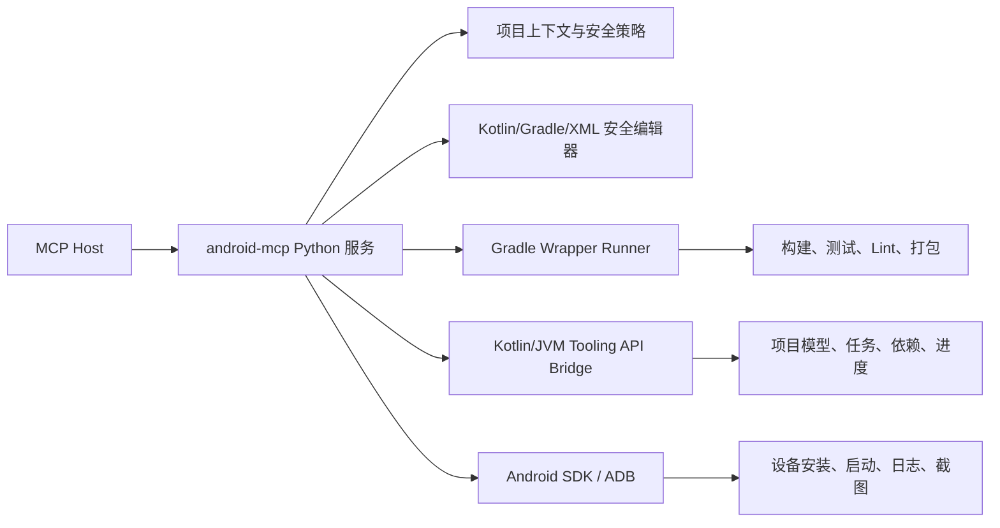

# Kotlin Android MCP 设计方案

## 总体方案

构建一个名为 `android-mcp` 的本地 Windows MCP 服务：

- MCP 主服务：Python，使用独立虚拟环境。
- Gradle 深度桥接：Kotlin/JVM fat JAR，使用 Gradle Tooling API。
- 编译执行：优先使用项目自带 `gradlew.bat`，Tooling API 用于项目模型、任务发现、构建事件和取消。
- Android Studio：负责 JBR、SDK 和 IDE 打开能力，不作为核心编译依赖。Android 官方推荐使用项目 Gradle Wrapper 执行构建任务；Debug APK 可通过 `assembleDebug` 生成。
- MCP 传输：本地 stdio，兼容 Codex、Claude、Trae 等 MCP 客户端。

Android Studio 实际上是 IDE；真正的 Android 编译、测试和打包后端是 Gradle Wrapper 与 Android Gradle Plugin。工具应把 Android Studio 作为环境发现和 IDE 打开器，把 Gradle 作为构建执行边界。



## MCP 工具接口

| 工具 | 主要能力 |
| --- | --- |
| `android_environment` | 检测 JDK、Android Studio、SDK、ADB、Gradle、AGP、Kotlin 环境 |
| `android_project` | 发现项目、模块、变体、Gradle 任务、依赖、同步和项目诊断 |
| `android_file` | 读取、搜索、批量替换、插入、删除、格式化、备份 Kotlin/KTS/XML 文件 |
| `android_build` | 执行 assemble、bundle、test、lint、check、clean、install |
| `android_device` | 设备列表、安装 APK、启动/停止应用、卸载、logcat、截图 |
| `android_task` | 长任务的状态、结果、取消和历史查询 |
| `tool_help` | 按工具和 action 返回参数说明、示例和工作流 |
| MCP Resources/Prompts | 提供 Android 编码规范、构建排障流程、设备测试流程和错误分类说明 |

公共参数统一采用：

```json
{
  "project_root": "D:/Android/adb-controller",
  "module": "app",
  "variant": "debug",
  "timeout_seconds": 1800
}
```

`project_root` 未提供时，只允许从当前工作目录或已配置的项目根目录推断，不扫描整个 `D:/Android`。

### `android_environment`

支持 `detect`、`doctor`、`check` 三类操作，返回 JDK、SDK、ADB、Android Studio、Gradle Wrapper、AGP、Kotlin 和 Build Tools 的路径、版本、兼容性和缺失项。

### `android_project`

支持 `discover`、`info`、`modules`、`variants`、`tasks`、`dependencies`、`sync`、`diagnose`。

Tooling API 用于项目模型和任务查询；Android 特有的变体和 APK 输出使用公开 Gradle 能力、任务信息和输出目录解析，不依赖 AGP 内部类。

### `android_file`

支持 `read`、`grep`、`write`、`replace`、`insert`、`delete`、`format`、`backup`。

修改参数采用：

```json
{
  "action": "replace",
  "project_root": "D:/Android/adb-controller",
  "file_path": "app/src/main/java/com/adbcontroller/ui/MainActivity.kt",
  "edits": [
    {
      "start_line": 20,
      "end_line": 20,
      "old_content": "旧内容",
      "content": "新内容"
    }
  ],
  "dry_run": true,
  "apply": false
}
```

规则：

- 修改操作先返回 diff，使用 `apply=true` 才落盘。
- 每个修改必须带 `old_content` 或文件版本哈希。
- 自动备份，支持回滚。
- 禁止路径逃逸。
- 禁止直接修改 `local.properties`、密钥库、密码配置、`.gradle`、`build` 和 `.idea`。
- 格式化优先调用项目已有的 `ktlint`/`spotless` 任务。

### `android_build`

支持 `assemble`、`bundle`、`test`、`lint`、`check`、`clean`、`install`。

主要参数：

```json
{
  "action": "assemble",
  "project_root": "D:/Android/adb-controller",
  "module": "app",
  "variant": "debug",
  "backend": "auto",
  "tasks": [],
  "timeout_seconds": 1800,
  "confirm_release": false
}
```

`backend=auto` 时优先使用 Tooling API，桥接器异常时回退到 Gradle Wrapper。任务名必须来自项目发现结果或受控的变体任务模板，不允许把任意 shell 命令传给工具。

### `android_device`

首版支持 `list`、`install`、`launch`、`stop`、`uninstall`、`logcat`、`screenshot`、`clear_log`。

- 多设备时强制要求 `serial`。
- APK 路径必须位于项目目录或已生成的构建产物目录。
- 首版不开放任意 `adb shell`。
- 暂不把 UIAutomator 和 Android Studio 窗口点击作为核心依赖。

### `android_task`

支持 `list`、`status`、`result`、`cancel`。构建、测试和安装等长任务立即返回 `task_id`，由客户端通过通知或轮询获得最终结果。

## 构建与诊断实现

### 环境检测顺序

1. JDK：项目 `org.gradle.java.home` → `JAVA_HOME` → Android Studio `jbr` → PATH。
2. SDK：项目 `local.properties` 的 `sdk.dir` → `ANDROID_SDK_ROOT`/`ANDROID_HOME` → Windows 默认 SDK 路径。
3. ADB：SDK `platform-tools/adb.exe` → PATH。
4. Gradle：项目 `gradlew.bat`/`gradlew`，不依赖全局 Gradle。
5. Android Studio：默认安装目录和用户配置目录。

当前环境没有配置 `JAVA_HOME`、Android SDK 环境变量或 PATH，但存在 Android Studio JBR、SDK 和 ADB，因此 MCP 必须主动注入环境变量后再启动 Gradle。

### Wrapper Runner

- 使用项目自己的 `gradlew.bat` 或 `gradlew`。
- 设置工作目录、JDK、SDK 和 Gradle 用户目录。
- 使用 `--console=plain` 获取稳定日志。
- 捕获 stdout、stderr、退出码、耗时和构建产物。
- 单个项目根目录同一时间只允许一个构建任务。
- 支持超时、取消和失败后日志保留。

### Kotlin/JVM Tooling Bridge

- 使用 Kotlin/JVM fat JAR。
- 通过 JSONL stdin/stdout 与 Python 主服务通信。
- 使用 `GradleConnector.forProjectDirectory(...).useBuildDistribution()`，跟随目标项目 Wrapper 版本。
- 查询项目层级、模块、任务、依赖和源目录。
- 监听任务执行、测试和构建进度。
- 支持构建取消。
- 使用公开的 `org.gradle.tooling` API，不依赖 Gradle 内部 API。

### 结构化构建结果

所有构建、测试和 Lint 操作统一返回：

```json
{
  "status": "completed",
  "task_id": "task_xxx",
  "backend": "tooling_api",
  "project_root": "D:/Android/adb-controller",
  "tasks": [":app:assembleDebug"],
  "exit_code": 0,
  "diagnostics": [],
  "artifacts": [
    {
      "path": "app/build/outputs/apk/debug/ADB_Controller.apk",
      "type": "apk",
      "module": "app",
      "variant": "debug"
    }
  ],
  "logs": {
    "stdout_path": "...",
    "stderr_path": "...",
    "tail": "..."
  }
}
```

错误解析覆盖：

- Kotlin 编译错误：文件、行号、列号、`unresolved reference`、类型错误。
- Gradle 任务失败。
- AAPT2 资源错误。
- Manifest merger 错误。
- D8/R8、Duplicate class、依赖解析错误。
- JVM target 不匹配。
- SDK、NDK、Build Tools 缺失。

## 安全策略

### Release 构建

- 默认只允许 Debug 构建。
- `assembleRelease`、`bundleRelease`、签名和发布任务必须显式传入确认参数。
- 永不读取或回显 `storePassword`、`keyPassword`、Token、API Key 等敏感值。
- 日志统一脱敏。

### 路径和命令

- 所有路径规范化后必须位于允许的项目根目录内。
- 默认禁止访问 `.git`、`.gradle`、`build`、密钥库和 `local.properties`。
- 不提供任意 PowerShell、CMD 或 shell 工具。
- Gradle 任务只能来自项目发现结果或内置安全模板。

### ADB

- 设备操作使用固定 action，不接受任意命令字符串。
- 多设备必须明确指定序列号。
- `uninstall`、清理数据和停止设备服务等操作要求显式确认。

## 配置与交付结构

配置采用三层：

- 全局配置：`%USERPROFILE%\\.android-mcp\\config.toml`
  - SDK、JDK、Android Studio、ADB、Gradle 用户目录和允许的项目根目录。
- 项目配置：项目内 `.androidmcp/project.toml`
  - 默认模块、默认变体、构建超时、Formatter 任务、设备序列号和安全策略。
- 运行状态：`%LOCALAPPDATA%\\android-mcp\\state\\<project-hash>\\`
  - 日志、任务状态、备份、构建结果和缓存，不污染 Git 工作区。

MCP 客户端配置示例：

```toml
[mcp_servers.android]
type = "stdio"
command = "C:\\path\\to\\android-mcp-venv\\Scripts\\python.exe"
args = ["-m", "android_mcp"]
startup_timeout_sec = 120
```

交付物包括：

- Python MCP 主服务。
- Kotlin/JVM Gradle Tooling Bridge fat JAR。
- Windows 安装脚本和独立虚拟环境。
- MCP 配置示例。
- 工具接口文档、Resources、Prompts 和排障手册。
- `adb-controller` 项目试点配置。

## 实施阶段

1. MCP 服务骨架、工具注册、配置加载、环境检测和 stdio 握手。
2. Gradle Wrapper Runner、Kotlin Tooling Bridge、项目模型和结构化诊断。
3. `android_file` 安全编辑、备份、diff、格式化和路径策略。
4. ADB 设备闭环、异步任务、日志和截图。
5. 以 `D:/Android/adb-controller` 验证 Debug 构建、单元测试、Lint、安装和启动。
6. 增加 Android Studio `open/open_file` 启动器；不实现依赖窗口点击的 IDE 自动化。

## 验收标准

- MCP 初始化后能列出全部工具、资源和 Prompt。
- 在没有设置 `JAVA_HOME`/`ANDROID_HOME` 的机器上，仍能自动发现 Android Studio JBR、SDK 和 ADB。
- 能识别试点工程的 Gradle 8.13、AGP 8.12.1、Kotlin 2.0.21、`app` 模块和 Debug 变体。
- `assembleDebug` 成功后返回 APK 路径、大小、哈希和构建日志。
- `test`、`lint`、`connectedAndroidTest` 能返回结构化结果。
- 人为制造 Kotlin、资源和 Manifest 错误时，能返回文件与行号诊断。
- 文件越权、无旧内容校验、修改密钥文件等操作必须拒绝。
- Release 构建未确认时必须拒绝，日志中不能出现签名密码。
- Tooling API 不可用时能自动回退 Wrapper。
- 无设备、多设备、设备离线时返回明确可操作的错误信息。

## 参考资料

- [Android 官方：从命令行构建应用](https://developer.android.com/build/building-cmdline)
- [Android 官方：ADB](https://developer.android.com/tools/adb)
- [Gradle 官方：Tooling API](https://docs.gradle.org/current/userguide/tooling_api.html)
- [MCP 官方：架构](https://modelcontextprotocol.io/docs/learn/architecture)
- [MCP 官方：stdio 传输](https://modelcontextprotocol.io/specification/draft/basic/transports)
